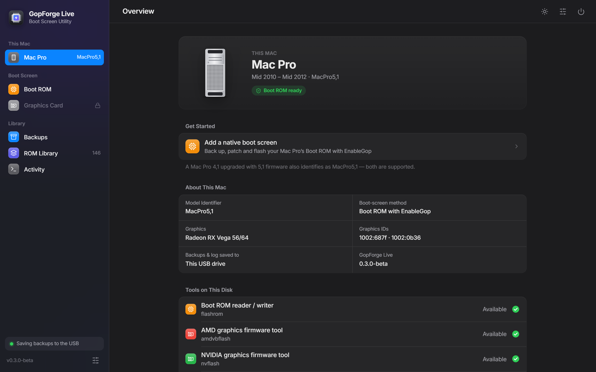
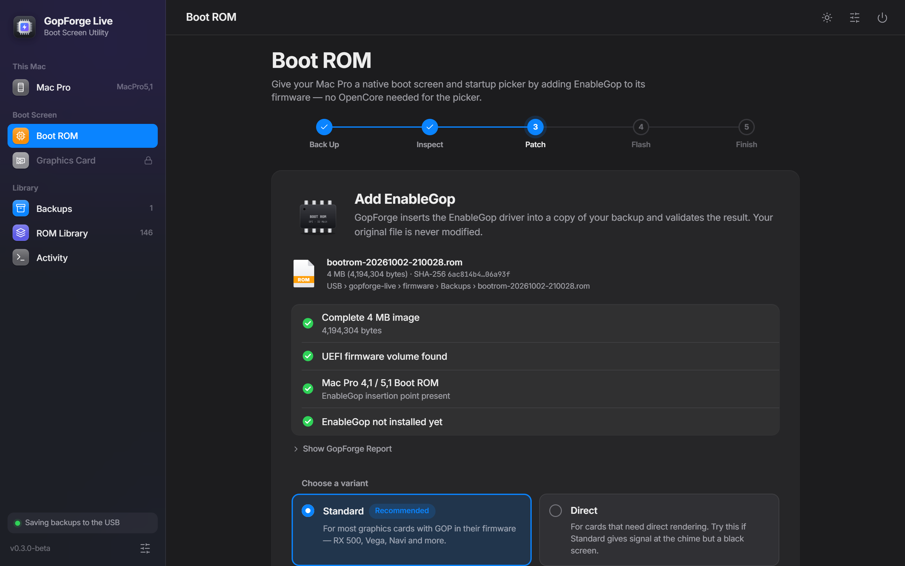
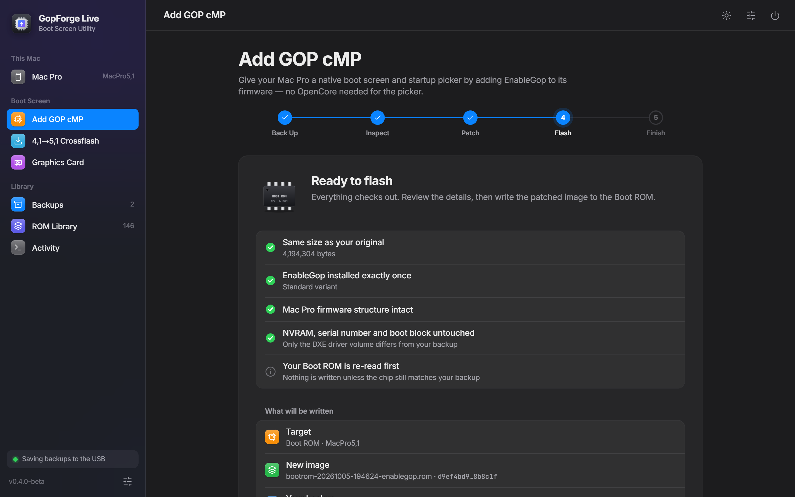
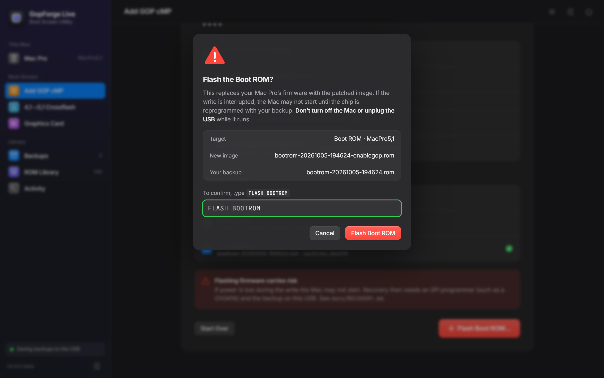
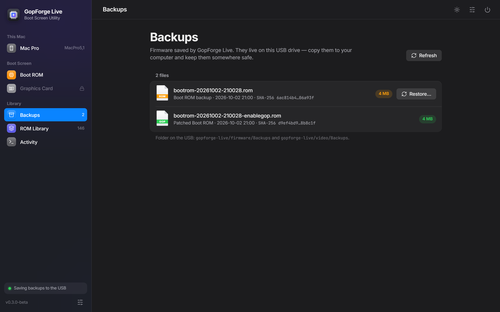
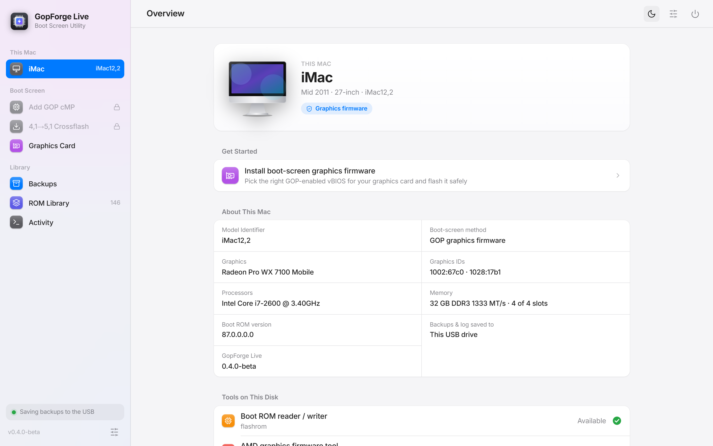
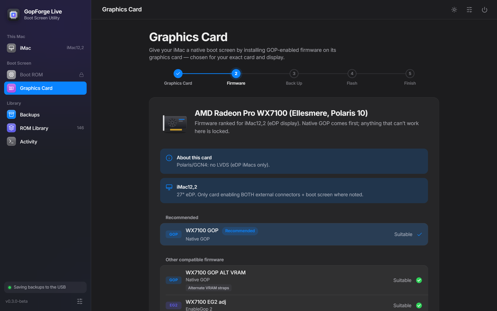

# GopForge-Live

**An all-in-one, bootable GOP boot-screen flashing wizard for EFI-era Macs.**



> ⚠️ **Status: `0.3.0-beta`.** Boots straight into the app on a real Mac Pro 5,1 and a
> 27" iMac12,2, and reads/backs up firmware on real hardware. Its Linux EnableGop
> injector produces a DXE volume byte-identical to dosdude1's DXEInject on a real
> MacPro5,1 Boot ROM. **No firmware has yet been flashed by GopForge-Live on real
> hardware** — treat flashing as experimental, follow [docs/TESTING.md](docs/TESTING.md),
> and don't flash a machine you can't recover ([docs/RECOVERY.md](docs/RECOVERY.md)).

GopForge-Live is a guided app (with a text-mode fallback) that runs inside the
[GRML-FLASH](https://github.com/Ausdauersportler/GRML-FLASH) live environment and
automates the whole path to a native pre-boot picker on an old Mac with a modern
GPU:

1. **Detect** the Mac model (`dmidecode`) and installed GPU(s) (`lspci`).
2. **Recommend** a known-good, GOP-enabled vBIOS from a curated catalog.
3. **Back up and flash** the GPU vBIOS (`amdvbflash` / `nvflash`).
4. **Dump → patch → flash** the Mac BootROM: `flashrom` reads it,
   [GopForge](https://github.com/KurdtNervanna/GopForge) injects EnableGop, and
   `flashrom` writes it back — all on Linux. GopForge's injector (dosdude1's
   DXEInject) is macOS-only, so the USB carries a Linux build of the same engine:
   [tools/dxeinject-linux](tools/dxeinject-linux/README.md) (validated against
   Apple's MP51.fd 144.0.0.0.0).

## Quick start

1. Download `gopforge-live-<version>.img.xz` from
   [**Releases**](https://github.com/KurdtNervanna/GopForgeLive/releases).
2. Write it to a USB stick (2 GB or more) with [balenaEtcher](https://etcher.balena.io/).
   Etcher reads the `.xz` directly. This erases the stick.
3. Boot the Mac holding **⌥ Option** and pick **EFI Boot**. The app starts by itself.
4. Follow [docs/TESTING.md](docs/TESTING.md). It walks you through backing up before
   anything is flashed.

## The app

The USB boots straight into a full-screen, macOS-style app (Firefox kiosk + a local
Python backend over the same engine as the text wizard): a device overview, guided
**Boot ROM** and **Graphics Card** flows with live progress, backups, the ROM library
and an activity log. It falls back to the text wizard automatically if graphics can't
start. See [docs/GUI.md](docs/GUI.md) — including `dev/run-gui-dev.sh`, which runs the
app against simulated hardware on any Linux/WSL box.

### Screenshots

| Mac Pro 4,1 / 5,1 — Boot ROM | |
|---|---|
|  |  |
| **Patch** — the backup is inspected, then you pick Standard or Direct EnableGop. | **Flash** — every check is shown before anything is written. |
|  |  |
| **Confirm** — type `FLASH BOOTROM`; the button only arms after three seconds. | **Backups** — every firmware image is kept on the USB and can be restored. |

| iMac 2009–2011 — graphics firmware | |
|---|---|
|  |  |
| **Overview** (light mode) — the model, display type and card are detected. | **Firmware** — ranked for this exact iMac and card; anything that can't work is locked. |

<sub>Screenshots are of the real app running on its built-in simulated hardware
(`dev/run-gui-dev.sh`), captured with `py dev/screenshots.py`.</sub>

## Compatible hardware

### Mac Pro 4,1 / 5,1 — Boot ROM (EnableGop)

EnableGop goes into the Mac Pro's Boot ROM and makes the firmware use the graphics card's
own **UEFI GOP**, so it works with any card whose firmware has GOP: for example Radeon
RX 400/500, Vega and RX 5000/6000 cards, and NVIDIA cards with UEFI firmware. Cards
without GOP in their firmware (e.g. Fury/Fiji and many older or ex-mining AMD cards)
also need a GOP vBIOS on the card itself. A Mac Pro 4,1 flashed to 5,1 firmware is
supported. Mac Pro 3,1 and earlier are not.

### iMac 2009–2011 — graphics firmware (MXM upgrades)

The app picks firmware for your exact iMac and card from the
[IMAC-EFI-BOOT-SCREEN](https://github.com/Ausdauersportler/IMAC-EFI-BOOT-SCREEN) library.

- **GOP** is native UEFI GOP firmware (preferred).
- **EG2** and **EG** are firmware with EnableGop built in. EG works on every supported iMac.
- **EG91** is the variant the iMac9,1 needs.
- **UGA** is the legacy boot screen.

"LVDS iMacs" are the iMac9,1 and the 21.5" iMac10,1 (A1311). Polaris and Navi cards have
no LVDS output, so on those iMacs they can't show the internal boot screen.

| Card | Chip | PCI ID | Firmware types | LVDS iMacs | Notes |
|---|---|---|---|---|---|
| AMD FirePro M4000 | GCN1 | `1002:682d` | GOP, EG2, EG, UGA | ✓ | Good low-power card, works down to iMac9,1. |
| AMD FirePro M5100 | GCN1 | `1002:6821` | GOP, EG2, EG, EG91, UGA | ✓ | Match the memory vendor (Elpida/Samsung vs Hynix AFR/BFR/AFS) to your card. A wrong memory ROM can corrupt VRAM training. |
| AMD FirePro M6000 | GCN1 | `1002:6825` | GOP, EG2, EG, EG91, UGA | ✓ |  |
| AMD FirePro M6100 | GCN1 | `1002:6640` | EG, EG91 | ✓ | Runs hot — overheats iMac9,1 under load. Match memory vendor. Only EnableGop (EG) ROMs are published for this card. |
| AMD FirePro W5170M | GCN1 | `1002:6820` | GOP, EG2, EG, EG91, UGA | ✓ |  |
| AMD FirePro W6150M | GCN1 | `1002:6646` | GOP, EG | — | Runs hot — overheats iMac9,1. |
| AMD FirePro W6170M | GCN1 | `1002:6646` | GOP, EG2, EG, EG91 | — | Runs hot — overheats iMac9,1. |
| AMD FirePro W7170M | GCN1 | `1002:6921` | EG2, EG | — |  |
| AMD FirePro S7100X | GCN3 | `1002:6930`, `1002:6939` | GOP, EG2, EG | — |  |
| AMD Radeon Pro WX3200 | GCN4-Polaris | `1002:6981` | GOP, EG | ✗ (eDP only) | Polaris/GCN4: no LVDS. Internal boot screen only on eDP iMacs (11,x/12,x). |
| AMD Radeon Pro WX4130 | GCN4-Polaris | `1002:67e8` | GOP, EG2, EG | ✗ (eDP only) | Polaris/GCN4: no LVDS (eDP iMacs only). If your VRAM differs, try the ALT_VRAM variant. |
| AMD Radeon Pro WX4150 | GCN4-Polaris | `1002:67e8` | GOP, EG2, EG | ✗ (eDP only) | Polaris/GCN4: no LVDS (eDP iMacs only). Match VRAM (std vs ALT_VRAM) and memory (HynixAJR variant) to your board. |
| AMD Radeon Pro WX4170 | GCN4-Polaris | `1002:67e8` | GOP, EG2, EG | ✗ (eDP only) | Polaris/GCN4: no LVDS (eDP iMacs only). |
| AMD Radeon Pro WX7100 | GCN4-Polaris | `1002:67c0` | GOP, EG2, EG | ✗ (eDP only) | Polaris/GCN4: no LVDS (eDP iMacs only). |
| AMD Radeon Pro RX470 | GCN4-Polaris | `1002:67df` | GOP, EG2 | ✗ (eDP only) | Device 67df is shared with RX480/570/580/590 — confirm this is an RX470 mobile before flashing. Polaris: eDP iMacs only. |
| AMD Radeon Pro RX480 | GCN4-Polaris | `1002:67df` | GOP, EG2, EG | ✗ (eDP only) | Device 67df is shared with RX470/570/580/590 — confirm the exact board. Polaris: eDP iMacs only. |
| AMD Radeon Pro RX5500XT | RDNA1 | `1002:7340` | EG2, EG | ✗ (eDP only) | Navi. Backlight control needs the legacy-vBIOS SSDT/DeviceProperties mod (upstream README, note 4). |
| AMD Radeon Pro M370 | GCN1 | `1002:6820` | EG2 | — |  |
| AMD Cape Verde XTA generic | GCN1 | `1002:6821` | EG2 | — | Generic Venus/Cape Verde XTA (device 6821) fallback. |
| AMD Radeon HD 7950 Mac | GCN1 | `1002:679a` | UGA | — | Legacy UGA boot-screen ROM only. |
| AMD Radeon R9 M290X | GCN3 | `1002:6801` | UGA | — | Marked UNTESTED upstream. |

| iMac | Panel | Notes |
|---|---|---|
| iMac9,1 | LVDS | A1225 24". Needs EnableGop91/LVDS ROMs. Best cards: M4000, M5100, W5170M, M6000. AVOID M6100/W6170M/W6150M (overheat under load). |
| iMac10,1-A1311 | LVDS | 21.5" LVDS. Use LVDS ROMs. Polaris/GCN4 (WX/RX) have no LVDS: internal boot screen only via external DP + driver board. |
| iMac10,1-A1312 | eDP | 27" eDP. EG2 shows a white screen here — use EG or GOP only. |
| iMac11,1 | eDP | 27" eDP. |
| iMac11,2 | eDP | 21.5" eDP. |
| iMac11,3 | eDP | 27" eDP. |
| iMac12,1 | eDP | 21.5" eDP. |
| iMac12,2 | eDP | 27" eDP. Only card enabling BOTH external connectors + boot screen where noted. |

<sub>Generated from [`catalog/imac-boot-screen-matrix.json`](catalog/imac-boot-screen-matrix.json)
(the same rules the app enforces) with `py dev/compat-table.py`. Firmware the app knows won't
work on your model (e.g. EG2 on the 27" iMac10,1) is blocked.</sub>

## Why it exists

GRML-FLASH gives you the tools but makes you drive them by hand. GopForge injects
EnableGop but relies on macOS-only Rom Dump to dump/flash the BootROM. GopForge-Live
stitches them together: `flashrom` *is* the dump/flash step GopForge leaves out, so
one USB does both the **GPU vBIOS** side and the **BootROM** side, with detection,
recommendation, mandatory backups, and confirmations wrapped around them.

## Layout

```
bin/gopwizard.sh        # text wizard (whiptail; falls back to plain prompts)
bin/gfl-api             # JSON API over the engine (used by the GUI)
gui/                    # graphical app: server.py, session.sh, static/ SPA, firefox/ prefs
dev/                    # run-gui-dev.sh + mock hardware for developing off-Mac
bin/lib/                # ui, detect, library, vbios, bootrom, safety
catalog/                # imac-boot-screen-matrix.json + SCHEMA.md (model/panel/memory rules)
docs/                   # INSTALL / TESTING / WORKFLOW / RECOVERY / GUI / REMASTER
tools/                  # fetch-vendor, fetch-roms, dxeinject-linux, install-to-usb, remaster-image
flash-usb/              # Windows/macOS/Linux USB writers + base-image fetcher
vendor/gopforge/        # populated by tools/fetch-vendor.sh (not committed)
roms/                   # full IMAC-EFI-BOOT-SCREEN vBIOS library (GPL-3.0, fetched, not committed)
```

## Make the bootable USB (Windows / macOS / Linux)

```bash
./tools/fetch-vendor.sh                 # GopForge + EnableGop tooling
./tools/fetch-roms.sh                   # the whole IMAC-EFI-BOOT-SCREEN vBIOS library
sudo ./tools/dxeinject-linux/build.sh   # Linux DXEInject (Boot ROM patching on the USB)
./flash-usb/get-base-image.sh           # download the GRML-FLASH base image
sudo ./flash-usb/write-image-linux.sh <image.img> /dev/sdX      # Linux
sudo ./flash-usb/write-image-macos.sh <image.img> /dev/diskN    # macOS
#   Windows (elevated PowerShell):
#   .\flash-usb\write-image-windows.ps1 -Image C:\path\grml-flash.img
```

Each writer erases the stick, writes the bootable image, and copies the wizard +
ROM library onto its FAT partition. See [flash-usb/README.md](flash-usb/README.md).
(Already have a GRML-FLASH USB? Skip the writers and use
`./tools/install-to-usb.sh /mnt/usb`.)

**All-in-one auto-launch image (Linux):** `tools/remaster-image.sh` bakes the wizard +
ROM library into a single bootable file that launches on boot (via an additive
live-boot squashfs module — the base image's Mac/PC boot is left untouched):
```bash
sudo ./tools/remaster-image.sh --img grml-flash.img --out gopforge-live.img
sudo ./flash-usb/write-image-linux.sh gopforge-live.img /dev/sdX --no-install
```
See [docs/REMASTER.md](docs/REMASTER.md). This is the recommended path: its auto-launch
is verified in QEMU (UEFI) and on a real Mac Pro. (`tools/build-image.sh`, which wires
autostart onto the data partition without remastering, is older and untested.)

## Boot the target machine

Power on the Mac holding **⌥ Option** and pick the USB (**EFI Boot**). The remastered
image opens the app automatically (text wizard as fallback); on a plain GRML-FLASH USB
run `sudo bash bin/gopwizard.sh`. It **detects the machine and offers only what applies**:

| Machine | Offered |
|---------|---------|
| Mac Pro 5,1 / 4,1 | BootROM EnableGop (dump → GopForge → flash). GPU flash off. |
| Supported iMac (2009–2011) | Guided GPU vBIOS flashing. BootROM path off. |
| Mac Pro 3,1 & earlier / other / non-Apple | Nothing (Expert override available). |

See [docs/INSTALL.md](docs/INSTALL.md) and [docs/WORKFLOW.md](docs/WORKFLOW.md).

## Safety model

- The wizard is **machine-gated**: it will not offer a path that doesn't apply to
  the detected machine (an unsupported machine gets nothing unless you knowingly
  enable the Expert override).
- Every hardware write is preceded by a **verified backup** (size + sha256), and
  **Backups › Restore** puts any of them back from inside the app.
- GPU ROMs are recommended from the **iMac boot-screen matrix**, which detects your
  iMac model + GPU and marks each candidate **✓ suitable / ⚠ caution / ✗ won't work**
  (Polaris has no LVDS; iMac9,1 needs EnableGop91; memory-vendor ROMs must match your
  VRAM). A ✗ from a method the model *forbids* (e.g. **EG2 white-screens on iMac10,1
  A1312**) is **hard-blocked**. Where `dmidecode` is ambiguous (iMac10,1 A1311 vs
  A1312) the wizard asks which model you have first.
- BootROM writes require a **double confirmation**; GopForge itself refuses to
  patch anything that isn't a MacPro4,1/5,1 image. A patched BootROM may differ from
  the backup **only inside the DXE volume** — NVRAM, serial/board data, microcode and
  the boot block must be byte-identical, or it is discarded / refused for writing.
  The chip is re-read right before the write and must still equal that backup.
- Read [docs/RECOVERY.md](docs/RECOVERY.md) and keep a CH341A handy for the
  BootROM path.

## Credits

Builds on [Ausdauersportler/GRML-FLASH](https://github.com/Ausdauersportler/GRML-FLASH),
[KurdtNervanna/GopForge](https://github.com/KurdtNervanna/GopForge),
acidanthera's EnableGop, dosdude1's DXEInject, and
[LongSoft/UEFITool](https://github.com/LongSoft/UEFITool) (the engine behind the Linux
injector, BSD-2-Clause). Not affiliated with Apple. Bundled third-party components and
their licenses: [THIRD-PARTY.md](THIRD-PARTY.md).

## License

MIT — see [LICENSE](LICENSE).
